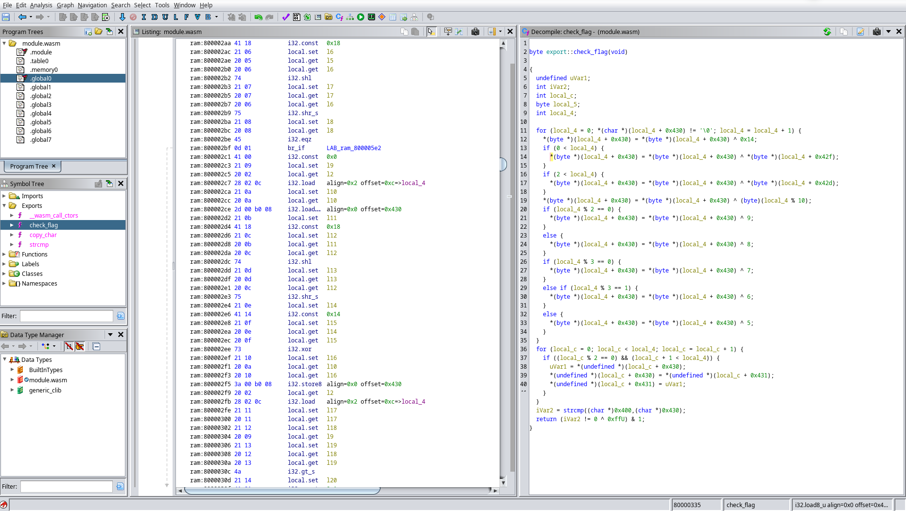

I've been looking at some old [picoCTF](https://picoctf.org/) challenges lately, and I stumbled upon
a series of [WebAssembly challenges](https://play.picoctf.org/practice/challenge/182?category=1&page=3)
from picoCTF 2021.
Since I don't know much about WASM, I decided to try them out.

The first 3 challenges of the series can be completed pretty easily with manual reverse
engineering.

The fourth (and last) one requires a bit more effort, which
convinced my lazy ass to look for some actual **tools** to do the job instead of
just staring at the code until it told me what I wanted.

Indeed, a part from one [incredibly brilliant solver](https://larry.science/post/picoctf-2021/#some-assembly-required-4)
that did not even reverse engineer the wasm code at all, most of the solutions
I found on the internet did most of the work manually, so maybe
this writeup can be useful to other noobs like me.

# Challenges 1-3

The general setup for all the challenges in the series is the same: you are given
a link to a webpage that asks you to input the flag. If the flag is wrong, the page will display the message `Incorrect!`, otherwise it prints `Correct!`.



Looking at the sources in the browser's inspector, we see a `js` file
and a `wasm` blob on the client, so we start from there.



## JS Deobfuscation

The javascript file is **obfuscated**: variable names look like hexadecimals (for example `const _0x2f65 = ...`) and instead of strings like `getElementById` we have a function that takes a number and performs some weird array lookup based on it. Seems complicated, but it's not.

Deobfuscating the script requires just some patience:
we can copy the script in an editor and simply find-replace the obfuscated names with some sensible ones. To speed up the work, we can use the browser console to print the array lookup for specific values.

What we end up after deobfuscation is something like this:

```js
//  ... Unimportant stuff here ...

function onButtonPress() {
    let val = // Get the value of the input field...

    // Call `copy_char()` on each char of the input.
    for (let i = 0x0; i < val["length"]; i++) {
        exports["copy_char"](val["charCodeAt"](i), i);
    }
    // Call `copy_char()` with the null terminator.
    exports["copy_char"](0x0, val["length"]);

    // Call `check_flag()` and display result.
    exports["check_flag"]() == 0x1 ? // Set the result field...
}
```

`exports` contains the functions exported by the WASM module, so  basically the javascript file is calling **two functions** of the WASM blob:
- `copy_char()` copies the input into the WASM memory
- `check_flag()` performs the check against the flag

We have a client-side check! Let's start reversing it.

## WASM Reversing

Chrome's dev tools are kind enough to disassemble the `wasm` binary into a `.wat` file (textual format) whenever we click on it.

Once we have the code in textual format, we can try to understand what it's doing. WASM is super simple, yet very tedious to reverse: this is an example of a snippet.

```asm
# Take the constant 0xFF.
i32.const 255
# Put it in $var26 (each variable is assigned once).
local.set $var26

# Get both $var25 and $var26.
local.get $var25
local.get $var26
# Perform a bitwise and between them.
i32.and
# Put the result into $var27.
local.set $var27
```

This whole code corresponds to:

```C
var27 = var25 & 0xFF;
```

As you can imagine, reversing big chunks of code like this takes a while, but at least the semantics of each single instruction is kinda straightforward.

# Challenge 4

As I said, I solved the first three challenges by hand, but the fourth one was a bit too much.

Downloading the `.wat` and checking for diffs from the previous versions reveals that the only change is in `check_flag()`, which is now ~800 lines long and contains a bunch of `goto` instructions. Reversing by hand seems like a waste of time.

## WABT

A quick Google search finds this [WebAssembly Binary Toolkit](https://github.com/WebAssembly/wabt) repository, which is exactly waht we need.

First, we copy the `.wat` code on a local file and use `wat2wasm` to produce a `wasm` binary.

```sh
wat2wasm picoCTF/chall.wat -o chall.wasm
```

Then, we can either use `wasm2c` to get the code translated to C or use `wat-decompile` to get an intermediate representation of the code that is more concise.

```sh
wasm2c picoCTF/chall.wasm -o chall.c
wasm-decompile picoCTF/chall.wasm -o chall.ir
```

Both the options are useful, also for earlier challenges, but the code is still too verbose. This is what we get in C for example:

```C
in strcmp(global_0) {
    // ...
    var_i0  = 255u;
    var_l19 = var_i0;
    var_i0  = var_l18;
    var_i1  = var_l19;
    var_i0  &= var_i1;
    var_l20 = var_i0;
    var_i0  = var_l4;
    // ...
}
```

The file is 16k lines long, and there's no easy way to reveal the secret at a first glance.

From a first glance, it seems like the input gets copied to the heap region in the WASM binary with `get_char()`, then it gets manipulated in-place with XORs by the `check_flag()` function, and finally the resulting string is compared with a constant string.

Our task is then simply to invert the operations of `check_flag()` and apply them to the constant string, which represents the obfuscated value of the flag.

## Lazy attempts

Hoping for a quick solve, I tried copying the obfuscated flag to the region where the input would normally be copied to and execute the `check_flag()` function on that, to see if the xorring function was reversible out-of-the box. Unfortunately, this was not the case.

Out of curiosity, I also tried to ask Google's chat AI (_Bard_) to translate the WASM code to C and refactor the C code to make it more concise, but the input was too big and, even for smaller pieces of code, the output did not seem completely correct.

So, disgruntled and underwhelmed by the state of LLMs, I went back to the searchbar: surely, there must be someone in the world that wrote a **WASM plugin for Ghidra** or IDA!

## Ghidra FTW

It would be way cooler if this was the story of how I wrote a WASM plugin for the [Ghidra decompiler](https://ghidra-sre.org/), but in the end I found an already existing [Ghidra plugin](https://github.com/nneonneo/ghidra-wasm-plugin) that is well maintained, updated and working. _Nice!_

Installing the plugin is straightforward, and after that if we import the `.wasm` file in Ghidra it gets automatically recognized.

After running the default analyses, we look at the _exports_ in the symbol tree and find our target, `check_flag()`. Once we open it in the decompiled view, we can already see that the code is much more concise that the `wasm2c` output.




At a glance, we already see that there are **two separate loops**, each with its own induction variable. Let's call them `i` and `j` to make the code more readable.

In the first loop, much of the code is computing `i + 0x430` and dereferencing the result. This is a strong indication that we are **accessing an array** based at 0x430.

We can verify this by double-clicking the constant, typing D to define an array of `uint_8[64]` and L to define a label (I called it `input`). Ghidra will restructure the C code to match this new information, and indeed we see that all that ugly pointer arithmetics is now gone.

Finally, we can condense `input[i] = input[i] ^ ...` to just `input[i] ^= ...`  where needed, and look at the **final result**.

```C
byte export::check_flag(void)
{
  uint8_t uVar1;
  int iVar2;
  int j;
  byte local_5;
  int i;

  // LOOP 1.
  for (i = 0; ::input[i] != '\0'; i = i + 1) {
    ::input[i]^= 0x14;

    // Hmm....
    if (0 < i) {
      ::input[i]^= *(byte *)(i + 0x42f);
    }
    if (2 < i) {
      ::input[i]^= *(byte *)(i + 0x42d);
    }

    ::input[i]^= (byte)(i % 10);
    if (i % 2 == 0) {
      ::input[i]^= 9;
    }
    else {
      ::input[i]^= 8;
    }
    if (i % 3 == 0) {
      ::input[i]^= 7;
    }
    else if (i % 3 == 1) {
      ::input[i]^= 6;
    }
    else {
      ::input[i]^= 5;
    }
  }
  // LOOP 2.
  for (j = 0; j < i; j = j + 1) {
    if ((j % 2 == 0) && (j + 1 < i)) {
      uVar1 = ::input[j];
      ::input[j] = ::input[j + 1];
      ::input[j + 1] = uVar1;
    }
  }

  // Compare with the obfuscated flag.
  iVar2 = strcmp((char *)0x400,(char *)::input);

  // Return 0 if the strcmp returned > 0 (i.e. they are
  // not the same string).
  return (iVar2 != 0 ^ 0xffU) & 1;
}
```

I have to say, this is even better that what I expected!

We can clearly see what the two loops are doing: the first loop is just **xorring** each character of the input with a bunch of constants and saving the result to the same position. The second loop is simply **exchanging** characters at even positions with their successor.

Since XOR is reversible, i.e. if `A ^ B = C` then `C ^ B = A`, and permutations are reversible, computing the inverse function is trivial.

The plan is simple:
1. Take the obfuscated flag from the WASM binary's memory
2. Execute _LOOP 2_ (moves each char back to its position)
2. Execute _LOOP 1_ (XORs everything again to reveal the flag)

## One Small Detail

There is one minor thing that we need to pay attention to, which are these two operations inside _LOOP 1_.

```C
if (0 < i) {
  ::input[i]^= *(byte *)(i + 0x42f);
}
if (2 < i) {
  ::input[i]^= *(byte *)(i + 0x42d);
}
```

Again, there is some constant that is added to the induction variable and then dereferenced, but it is unlikely that this is another array, because it would overlap with the previous one.

Going back to the original wasm, we see that this is most likely an **artifact of decompilation**: `0x42f` and `0x42d` are the result of `0x430 - 1` and  `0x430 - 3`.

By keeping this in mind we can, for example, rewrite the memory access in the first operation as follows.

```C
   *(byte *)(i + 0x42f)
=> *(byte *)(i + 0x430 - 1)
=> *(byte *)(0x430 + (i - 1))

```

Which is simply accessing the same array but with index `i-1`. The two operations of _LOOP 1_ then become:


```C
if (0 < i)
  input[i] ^= input[i-1];
if (2 < i)
  input[i] ^= input[i-3];
```

Basically, we are xorring each value of the with some preceding value as well.

With a bit of pen and paper it's easy to demonstrate that, if we want to invert these operations, the right way of doing it is traversing LOOP 1 **backwards**.

## Flag, at last!

After putting everything together, this is the final solution. The flag was copy-pasted from the `wasm2c` output produced before.

```C
#include <stdint.h>
#include <stdio.h>

// Obfuscated flag found in the WASM blob.
uint8_t flag[] = {
    0x18, 0x6a, 0x7c, 0x61, 0x11, 0x38, 0x69, 0x37, 0x1e,
    0x5f, 0x7d, 0x5b, 0x68, 0x4b, 0x5d, 0x3d, 0x02, 0x18,
    0x14, 0x7b, 0x65, 0x36, 0x45, 0x5d, 0x28, 0x5c, 0x33,
    0x45, 0x09, 0x39, 0x56, 0x44, 0x42, 0x7d, 0x3b, 0x6f,
    0x40, 0x57, 0x7f, 0x0e, 0x59, 0x00, 0x00,
};
const uint8_t flag_len = 41;

// Reverse of LOOP 1.
void undo_xor() {
    // Visit the array in reverse order.
    for (int i = flag_len; i >= 0; i--) {
        flag[i] ^= 0x14;

        // XOR with previous values.
        if (0 < i)
          flag[i] ^= flag[i-1];
        if (2 < i)
          flag[i] ^= flag[i-3];


        flag[i]^= (byte)(i % 10);

        // Even/Odd.
        if (i % 2 == 0)
          flag[i] ^= 9;
        else
          flag[i] ^= 8;

        // Multiples of 3.
        if (i % 3 == 0)
          flag[i] ^= 7;
        else if (i % 3 == 1)
          flag[i] ^= 6;
        else
          flag[i] ^= 5;

    }
}

// Same of LOOP 2.
void undo_permute() {
    for (int j = 0; j < flag_len; j++) {
        if ((j % 2 == 0) && (j + 1 < flag_len)) {
            int tmp = flag[j];
            flag[j] = flag[j + 1];
            flag[j + 1] = tmp;
        }
    }
}

int main() {
  undo_permute();
  undo_xor();

  for (int i = 0; i < flag_len; i++)
    printf("%c", flag[i]);

  return 0;
}

```

And there we go, we have the 🚩.


## Conclusions

I am not sure that the Ghidra plugin already existed during the original CTF, without that it would have been an awful challenge I think.

But, done now, this is a nice little entry-level challenge for people approaching reverse engineering, especially to learn new tools and get a gentle introduction to Ghidra as well.
